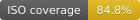
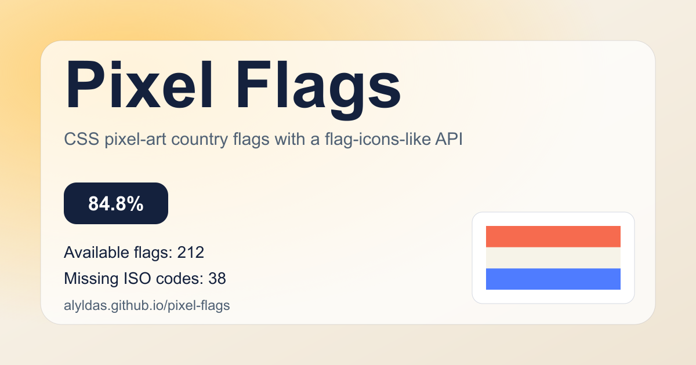

# Pixel Flags

[CI workflow](.github/workflows/ci.yml)
[](reports/coverage.md)

Pixel-art country flags with a `flag-icons`-style CSS API.

Live demo: [alyldas.github.io/pixel-flags](https://alyldas.github.io/pixel-flags/)

[](site/index.html)

```html
<link rel="stylesheet" href="./css/pixel-flags.css" />
<span class="pf pf-ru" role="img" aria-label="Russia"></span>
```

## Installation

```bash
npm install pixel-flags
```

## Usage

### Bundlers

```js
import "pixel-flags/css/pixel-flags.css";
```

The minified entrypoint is also published:

```js
import "pixel-flags/css/pixel-flags.min.css";
```

### Vite

```js
import "pixel-flags/css/pixel-flags.css";
import "./app.css";
```

```html
<span class="pf pf-br" aria-label="Brazil"></span>
```

### Plain HTML

```html
<link rel="stylesheet" href="./css/pixel-flags.css" />
<span class="pf pf-us" role="img" aria-label="United States"></span>
```

### Sizing

Flags scale with surrounding `font-size`, or you can set an explicit CSS variable:

```html
<span class="pf pf-jp" style="font-size: 2rem" role="img" aria-label="Japan"></span>
<span class="pf pf-jp" style="--pf-height: 2rem" role="img" aria-label="Japan"></span>
```

### Accessibility

If a flag conveys meaning, add `role="img"` and an `aria-label`:

```html
<span class="pf pf-jp" role="img" aria-label="Japan"></span>
```

If it is decorative only:

```html
<span class="pf pf-fr" aria-hidden="true"></span>
```

## What's Included

- `css/pixel-flags.css` for readable production usage
- `css/pixel-flags.min.css` for compact delivery
- `flags/*.png` for direct asset access
- generated demo site files in `site/` (deployed to [alyldas.github.io/pixel-flags](https://alyldas.github.io/pixel-flags/))

## What It Does Not Include

- square flag variants
- aliases for missing territories
- a JavaScript runtime API
- full ISO coverage yet

## Browser Support

| Browser    | Support                            |
| ---------- | ---------------------------------- |
| Chrome     | Current and previous major release |
| Edge       | Current and previous major release |
| Firefox    | Current and previous major release |
| Safari     | Current and previous major release |
| iOS Safari | Current and previous major release |

The package targets modern browsers with support for CSS `background-image`, `calc()`, and `image-rendering: pixelated`.

## Coverage

<!-- coverage:start -->

- ISO total: `250`
- Available flags: `212`
- Missing ISO codes: `38`
- Coverage: `84.8%`
- Full details: [reports/coverage.md](reports/coverage.md)
<!-- coverage:end -->

## Asset Licensing

Repository code, build scripts, generated CSS, tests, and documentation are MIT-licensed.

Bundled PNG assets are derived from R74n Pixel Flags and use separate upstream terms.

- Asset notice: [NOTICE.md](NOTICE.md)
- Upstream asset source: [R74n Pixel Flags](https://r74n.com/pixelflags/)
- Upstream content license: [R74n Content License 1.1](https://r74n.com/license.txt)

## Development

```bash
npm run clean
npm run hooks:install
npx playwright install chrome-for-testing
npm run format
npm run format:check
npm run lint
npm run lint:workflows
npm run docs:check
npm run validate:assets
npm run build
npm run coverage
npm test
npm run smoke
npm run test:all
npm run assemble:pages
npm run verify
```

## Publishing

- `npm test` runs deterministic checks for generated CSS, coverage artifacts, and package-install behavior.
- `npm run smoke` runs the browser smoke test against the generated static site.
- `npm run lint` runs ESLint for scripts and tests.
- `npm run lint:workflows` runs actionlint for GitHub Actions workflows.
- `npm run docs:check` checks repository Markdown links.
- `npm run validate:assets` validates flag asset names, dimensions, and ISO coverage eligibility.
- `npm run format:check` runs Prettier checks.
- `npm run verify` runs build, coverage, tests, and tarball surface validation.
- `npm run pack:check` parses `npm pack --json --dry-run` and rejects unexpected packed files.
- `npm run release:notes` extracts release notes for the current `package.json` version from `CHANGELOG.md`.
- `npm run github:hardening -- owner/repo` applies baseline `main` branch and `v*` tag protections (requires repo admin + `gh` auth).
- `npm run assemble:pages` creates the `_site/` artifact from `site/`, `css/`, and `flags/`.
- release publishing is handled by `.github/workflows/release.yml`
- release tags must match `package.json` and point to a commit already contained in `origin/main`
- if `NPM_TOKEN` is missing, npm publish is skipped instead of failing the whole release workflow
- CI is split into `Fast Checks` (format/lint/build/test/pack) and `Browser Smoke`.

## Release Process

1. Make sure `package.json` version is the intended release version.
2. Update `CHANGELOG.md` for that version.
3. Run `npm run verify`.
4. Run `npm run smoke` in an environment where Playwright Chromium can launch.
5. Push the release commit to `main`.
6. Create and push a matching tag such as `v0.1.0`.
7. Confirm `.github/workflows/release.yml` completed and, if `NPM_TOKEN` is configured, verify the npm publish result.

## Changelog

See [CHANGELOG.md](CHANGELOG.md).

## Security

See [SECURITY.md](SECURITY.md).

## Community

- Support: [SUPPORT.md](SUPPORT.md)
- Code of Conduct: [CODE_OF_CONDUCT.md](CODE_OF_CONDUCT.md)

## Credits

- API inspiration: [flag-icons](https://github.com/lipis/flag-icons)
- PNG source: [R74n Pixel Flags](https://r74n.com/pixelflags/)
